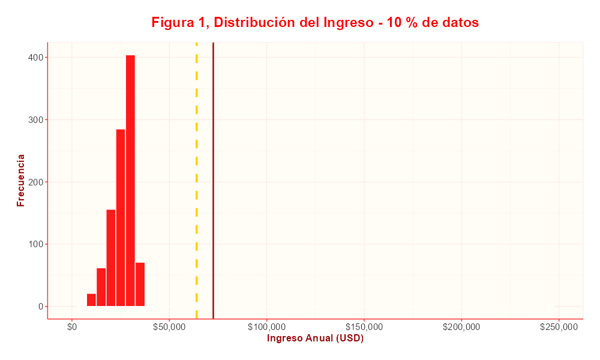
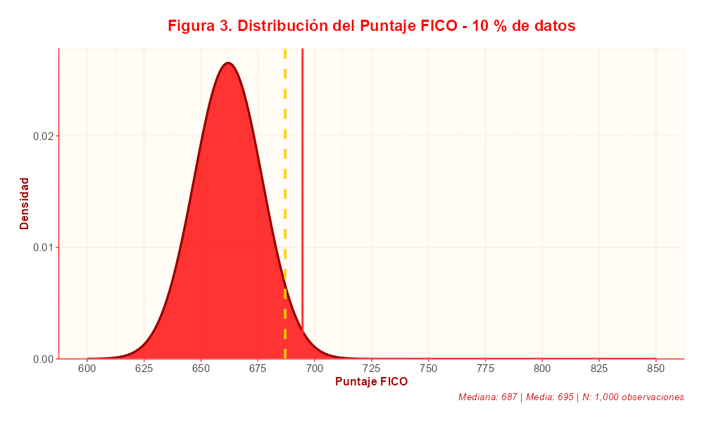

# inicio
```{r Librerias, include=FALSE}
knitr::opts_chunk$set(
  echo = TRUE,          
  warning = FALSE,
  message = FALSE,
  fig.align = "center",
  out.width = "85%",
  comment = ""          
)
#Librerias

library(dplyr)
library(tidyr)
library(readr)
library(tidyverse)
library(class)
library(caret)
library(pROC)
library(ggthemes)
library(lubridate)
library(kableExtra)
library(knitr)
library(ggcorrplot)
library(scales)
library(gridExtra)
library(grid)
library(ggplotify)
library(broom)
library(DT)
library(dplyr)
library(scales)
library(htmltools)
library(plotly)
library(gganimate)
```

```{r tema grafias, include=FALSE}
TS <- function() {
  theme_minimal(base_size = 12) +
    theme(
      text = element_text(
        color = "#2c2c2c"
      ),
      plot.title = element_text(
        family = "Playfair Display",
        face = "bold",
        color = "#FF0000",
        size = rel(1.4),
        hjust = 0.5,
        margin = margin(b = 15)
      ),
      plot.subtitle = element_text(
        family = "Source Serif Pro",
        color = "#CC0000",
        size = rel(1.0),
        hjust = 0.5,
        margin = margin(b = 20)
      ),
      plot.caption = element_text(
        family = "Source Serif Pro",
        color = "#666666",
        size = rel(0.8),
        hjust = 1,
        face = "italic"
      ),
      axis.title = element_text(
        family = "Playfair Display",
        color = "#990000",
        size = rel(1.0),
        face = "bold"
      ),
      axis.text = element_text(
        color = "#333333",
        size = rel(0.9)
      ),
      legend.title = element_text(
        family = "Playfair Display",
        color = "#990000",
        face = "bold",
        size = rel(0.9)
      ),
      legend.text = element_text(
        color = "#333333",
        size = rel(0.8)
      ),
      panel.background = element_rect(fill = "#FFFDF5", color = NA),
      plot.background = element_rect(fill = "white", color = NA),
      panel.grid.major = element_line(
        color = "#FFE5E5",
        linewidth = 0.3,
        linetype = "solid"
      ),
      panel.grid.minor = element_line(
        color = "#FFE5E5",
        linewidth = 0.1,
        linetype = "solid"
      ),
      panel.border = element_rect(
        fill = NA,
        color = "#FFE5E5",
        linewidth = 0.5
      ),
      axis.line = element_line(
        color = "#FF3333",
        linewidth = 0.5
      ),
      axis.ticks = element_line(
        color = "#FF3333",
        linewidth = 0.5
      ),
      legend.background = element_rect(
        fill = "#FFFDF5",
        color = "#FFE5E5"
      ),
      legend.key = element_rect(
        fill = "#FFFDF5",
        color = NA
      ),
      legend.position = "top",
      legend.justification = "center",
      plot.margin = margin(20, 20, 20, 20),
      panel.spacing = unit(1, "lines"),
      strip.background = element_rect(
        fill = "#FF0000",
        color = "#CC0000"
      ),
      strip.text = element_text(
        family = "Playfair Display",
        color = "white",
        face = "bold",
        size = rel(0.9)
      )
    )
}

scale_fill_sebastian <- function(palette = "main", ...) {
  scale_fill_manual(
    values = c(
      sebastian_colors["primary_red"],
      sebastian_colors["secondary_red"], 
      sebastian_colors["accent_red"],
      sebastian_colors["gold"],
      sebastian_colors["dark_red"]
    ),
    ...
  )
}


SC <- c(
  primary_red = "#FF0000",
  secondary_red = "#CC0000", 
  accent_red = "#FF3333",
  light_red = "#FFE5E5",
  dark_red = "#990000",
  gold = "#FFD100",
  parchment = "#FFFDF5",
  white = "#FFFFFF",
  gray_text = "#333333"
)

set_sebastian_theme <- function() {
  theme_set(TS())
  update_geom_defaults("bar", list(fill = sebastian_colors["primary_red"]))
  update_geom_defaults("col", list(fill = sebastian_colors["primary_red"]))
  update_geom_defaults("point", list(color = sebastian_colors["primary_red"]))
  update_geom_defaults("line", list(color = sebastian_colors["primary_red"]))
  update_geom_defaults("boxplot", list(fill = sebastian_colors["light_red"]))
  update_geom_defaults("violin", list(fill = sebastian_colors["light_red"]))
  update_geom_defaults("density", list(fill = sebastian_colors["light_red"]))
}
  
scale_color_sebastian <- function(palette = "main", ...) {
  scale_color_manual(
    values = c(
      sebastian_colors["primary_red"],
      sebastian_colors["secondary_red"],
      sebastian_colors["accent_red"],
      sebastian_colors["gold"],
      sebastian_colors["dark_red"]
    ),
    ...
  )
}

```


```{r Tema, include=FALSE}
Sebastian_css <- "

@import url('https://cdnjs.cloudflare.com/ajax/libs/font-awesome/6.4.0/css/all.min.css');
@import url('https://fonts.googleapis.com/css2?family=Playfair+Display:wght@400;600;700&family=Source+Serif+Pro:wght@300;400;600&display=swap');
@import url('https://fonts.googleapis.com/css2?family=Playfair+Display:wght@400;600;700&family=Source+Serif+Pro:wght@300;400;600&display=swap');

:root {
  --primary-red: #FF0000;       /* Rojo puro y vibrante */
  --secondary-red: #CC0000;     /* Rojo más oscuro para contraste */
  --accent-red: #FF3333;        /* Rojo más suave para detalles */
  --light-red: #FFE5E5;         /* Fondo suave rojo clarísimo */
  --dark-red: #990000;          /* Rojo oscuro para texto o bordes */
  --gold: #FFD100;              /* Dorado Univalle para acentos */
  --parchment: #FFFDF5;         /* Base crema suave */
  --W: #FFFFFF;
  --gris-texto: #333333;
}

body {
  font-family: 'Source Serif Pro', 'Times New Roman', serif;
  font-weight: 400;
  line-height: 1.7;
  color: #2c2c2c;
  background-color: var(--parchment);
  font-size: 16px;
}

.main-content {
  max-width: 1200px;
  margin: 0 auto;
  padding: 2rem;
  background: white;
  box-shadow: 0 0 30px rgba(122, 28, 28, 0.08);
  border-left: 1px solid var(--light-red);
  border-right: 1px solid var(--light-red);
}


/* ENCABEZADOS ACADÉMICOS - CORREGIDOS A ROJOS */
h1, h2, h3, h4, h5, h6 {
  font-family: 'Playfair Display', 'Times New Roman', serif;
  color: var(--primary-red) !important;
  border-bottom: none;
  margin-top: 2.5rem;
  margin-bottom: 1.5rem;
  font-weight: 600;
}

h1 {
  font-size: 2.8rem;
  font-weight: 700;
  text-align: center;
  margin-bottom: 2rem;
  padding-bottom: 1.5rem;
  border-bottom: 3px double var(--gold);
  letter-spacing: -0.5px;
  color: var(--primary-red) !important;
}

h2 {
  font-size: 2.1rem;
  border-left: 5px solid var(--accent-red);
  padding-left: 1.2rem;
  margin-top: 3.5rem;
  background: linear-gradient(90deg, var(--light-red) 0%, transparent 100%);
  padding-top: 0.5rem;
  padding-bottom: 0.5rem;
  color: var(--secondary-red) !important;
}

h3 {
  font-size: 1.6rem;
  color: var(--accent-red) !important;
  border-bottom: 2px solid var(--light-red);
  padding-bottom: 0.7rem;
  margin-top: 2.5rem;
}

h4 {
  font-size: 1.4rem;
  color: var(--secondary-red) !important;
  margin-top: 2rem;
  font-weight: 600;
}

h5 {
  font-size: 1.2rem;
  color: var(--accent-red) !important;
  margin-top: 1.5rem;
}

h6 {
  font-size: 1.1rem;
  color: var(--dark-red) !important;
  margin-top: 1.5rem;
  font-style: italic;
}

/* SUBTÍTULOS Y ELEMENTOS DE TEXTO */
.subtitle {
  color: var(--W) !important;
  font-family: 'Source Serif Pro', serif;
  font-size: 1.3rem;
  text-align: center;
  margin-bottom: 2rem;
  font-weight: 400;
}

.caption {
  color: var(--accent-red) !important;
  font-family: 'Source Serif Pro', serif;
  font-size: 0.95rem;
  font-style: italic;
  margin-top: 0.5rem;
}


/* HEADER ACADÉMICO */
.page-header {
  background: linear-gradient(135deg, var(--dark-red) 0%, var(--primary-red) 100%) !important;
  color: white;
  padding: 5rem 2rem !important;
  text-align: center;
  font-family: 'Playfair Display', serif;
  border-bottom: 5px solid var(--gold);
  margin-bottom: 3rem !important;
}

.page-header h1 {
  color: white !important;
  font-size: 3.3rem;
  font-weight: 700;
  border-bottom: none;
  margin-bottom: 1rem;
  text-shadow: 2px 2px 6px rgba(0,0,0,0.4);
  letter-spacing: -0.5px;
}

.page-header h2 {
  color: rgba(255,255,255,0.95) !important;
  font-size: 1.9rem;
  font-weight: 300;
  border-left: none;
  padding-left: 0;
  font-family: 'Source Serif Pro', serif;
  background: none;
  padding: 0;
}

/* FOOTER ACADÉMICO */
.academic-footer {
  text-align: center;
  color: var(--secondary-red);
  margin-top: 5rem;
  padding: 3rem 2rem;
  border-top: 3px double var(--light-red);
  font-family: 'Playfair Display', serif;
  background: linear-gradient(135deg, var(--parchment) 0%, white 100%);
  border-radius: 8px 8px 0 0;
}

/* MEJORAS PARA GRÁFICOS */
.plotly.html-widget {
  border-radius: 8px;
  box-shadow: 0 4px 12px rgba(0,0,0,0.08);
  padding: 1rem;
  background: white;
}

/* RESPONSIVE */
@media (max-width: 768px) {
  .main-content {
    padding: 1rem;
    margin: 0.5rem;
  }
  
  h1 {
    font-size: 2.2rem;
  }
  
  h2 {
    font-size: 1.8rem;
  }
  
  .page-header {
    padding: 3rem 1rem !important;
  }
  
  .tocify {
    width: 280px !important;
  }
  
  .chunk-controls {
    flex-direction: column;
    gap: 0.5rem;
    text-align: center;
  }
}

/* Agrega esto al final de tu Sebastian-styles.css */

/* SISTEMA DE TOGGLE PARA CÓDIGO */
.code-toggle-container {
  text-align: center;
  margin: 2rem 0;
  padding: 1.5rem;
  background: var(--light-red);
  border-radius: 10px;
  border-left: 4px solid var(--accent-red);
  box-shadow: 0 4px 12px rgba(179, 8, 56, 0.1);
}

.code-toggle-btn {
  background: linear-gradient(135deg, var(--primary-red), var(--secondary-red));
  color: white;
  border: none;
  padding: 1rem 2rem;
  border-radius: 8px;
  font-family: 'Playfair Display', serif;
  font-size: 1.1rem;
  font-weight: 600;
  cursor: pointer;
  transition: all 0.3s ease;
  box-shadow: 0 4px 12px rgba(122, 28, 28, 0.3);
  margin: 0 0.5rem;
}

.code-toggle-btn:hover {
  transform: translateY(-3px);
  box-shadow: 0 6px 18px rgba(122, 28, 28, 0.4);
  background: linear-gradient(135deg, var(--secondary-red), var(--primary-red));
}

/* CONTENEDORES DE CÓDIGO CON TOGGLE */
.code-chunk {
  margin: 2rem 0;
  border: 2px solid var(--light-red);
  border-radius: 12px;
  overflow: hidden;
  box-shadow: 0 4px 16px rgba(0,0,0,0.08);
  transition: all 0.3s ease;
}

.code-header {
  background: linear-gradient(135deg, var(--primary-red), var(--secondary-red));
  color: white;
  padding: 1rem 1.5rem;
  display: flex;
  justify-content: space-between;
  align-items: center;
  cursor: pointer;
  transition: all 0.3s ease;
}

.code-header:hover {
  background: linear-gradient(135deg, var(--secondary-red), var(--primary-red));
}

.chunk-title {
  font-family: 'Playfair Display', serif;
  font-weight: 600;
  font-size: 1.1rem;
  margin: 0;
}

.toggle-icon {
  font-family: 'Source Serif Pro', serif;
  font-weight: 700;
  font-size: 1.2rem;
  transition: transform 0.3s ease;
}

.toggle-icon.rotated {
  transform: rotate(180deg);
}

.code-content {
  background: #1e1e1e;
  transition: all 0.3s ease;
  overflow: hidden;
}

.code-content.collapsed {
  max-height: 0;
  opacity: 0;
}

.code-content.expanded {
  max-height: 5000px;
  opacity: 1;
}


/* BOTÓN FLOTANTE GLOBAL */
.global-code-toggle {
  position: fixed;
  top: 20px;
  right: 20px;
  z-index: 10000;
  background: linear-gradient(135deg, var(--primary-red), var(--secondary-red));
  color: white;
  border: none;
  padding: 0.8rem 1.2rem;
  border-radius: 50px;
  font-family: 'Playfair Display', serif;
  font-weight: 600;
  cursor: pointer;
  box-shadow: 0 4px 16px rgba(179, 8, 56, 0.4);
  transition: all 0.3s ease;
}

.global-code-toggle:hover {
  transform: translateY(-2px);
  box-shadow: 0 6px 20px rgba(179, 8, 56, 0.6);
}

/* INDICADOR DE ESTADO */
.code-status {
  display: inline-block;
  width: 8px;
  height: 8px;
  border-radius: 50%;
  margin-right: 8px;
}

.code-status.visible {
  background: #4CAF50;
}

.code-status.hidden {
  background: #ff9800;
}
* TOC - TABLA DE CONTENIDOS MEJORADA */
#TOC {
  background: linear-gradient(135deg, var(--parchment) 0%, white 100%) !important;
  border: 2px solid var(--light-red) !important;
  border-radius: 12px !important;
  padding: 2rem !important;
  margin: 2rem 0 !important;
  box-shadow: 0 4px 20px rgba(122, 28, 28, 0.1) !important;
  font-family: 'Playfair Display', serif !important;
}

#TOC::before {
  content: \"Tabla de Contenidos\";
  display: block;
  font-family: 'Playfair Display', serif;
  font-size: 1.4rem;
  font-weight: 700;
  color: var(--primary-red);
  margin-bottom: 1.5rem;
  padding-bottom: 0.5rem;
  border-bottom: 2px solid var(--gold);
}

#TOC ul {
  list-style: none !important;
  padding-left: 0 !important;
  margin: 0 !important;
}

#TOC li {
  margin: 0.8rem 0 !important;
  padding: 0 !important;
  border-left: 3px solid transparent;
  transition: all 0.3s ease;
}

#TOC li:hover {
  border-left-color: var(--accent-red);
  background: var(--light-red);
}

#TOC a {
  color: var(--secondary-red) !important;
  text-decoration: none !important;
  font-family: 'Source Serif Pro', serif !important;
  font-size: 1rem !important;
  padding: 0.5rem 1rem !important;
  display: block !important;
  transition: all 0.3s ease !important;
  border-radius: 4px;
}

#TOC a:hover {
  color: var(--primary-red) !important;
  background: var(--light-red) !important;
  transform: translateX(5px);
}

#TOC ul ul {
  padding-left: 1.5rem !important;
  margin-top: 0.5rem !important;
}

#TOC ul ul a {
  font-size: 0.95rem !important;
  color: var(--dark-red) !important;
  padding: 0.3rem 1rem !important;
}

#TOC ul ul li {
  margin: 0.5rem 0 !important;
}

/* ESTILOS PARA EL CÓDIGO - TEMA RSTUDIO (CLARO) */
pre.sourceCode {
  display: block !important;
  background: var(--W) !important;
  color: var(--gris-texto) !important;
  padding: 15px !important;
  border: none !important;
  border-radius: 8px !important;
  overflow-x: auto;
  margin: 15px 0 !important;
  font-family: 'Consolas', 'Monaco', 'Courier New', monospace !important;
  font-size: 0.85em;
  line-height: 1.4;
  border-left: 4px solid var(--primary-red) !important;
  box-shadow: 0 2px 4px rgba(179, 25, 66, 0.1);
}


pre.sourceCode code {
  background: transparent !important;
  color: #333 !important;
  padding: 0 !important;
  font-family: 'Consolas', 'Monaco', 'Courier New', monospace !important;
}


pre.sourceCode code .kw { color: var(--primary-red); font-weight: bold; } /* Keywords */
pre.sourceCode code .dt { color: var(--gold); } /* Data types */
pre.sourceCode code .dv { color: var(--gold); } /* Numeric values */
pre.sourceCode code .st { color: var(--secondary-red); } /* Strings */
pre.sourceCode code .co { color: #666; font-style: italic; } /* Comments */
pre.sourceCode code .ot { color: var(--primary-red); } /* Operators */
pre.sourceCode code .fu { color: var(--primary-red); } /* Functions */
pre.sourceCode code .va { color: var(--accent-red); } /* Variables */
pre.sourceCode code .ident { color: var(--accent-red); } /* Identifiers */

/* Estilo para números de línea si se requieren */
pre.sourceCode .number {
  color: var(--secondary-red);
  font-weight: bold;
}

/* Scrollbar personalizado para el bloque de código */
pre.sourceCode::-webkit-scrollbar {
  height: 8px;
  background-color: var(--W);
}

pre.sourceCode::-webkit-scrollbar-thumb {
  background-color: var(--gold);
  border-radius: 4px;
}

pre.sourceCode::-webkit-scrollbar-thumb:hover {
  background-color: var(--gold);
}

.main-content p {
  text-align: justify;
  text-justify: inter-word;
  hyphens: auto;
  margin-bottom: 1.2rem;
}

/* ESTILOS PARA TABLAS ACADÉMICAS */
.academic-table {
  font-family: 'Source Serif Pro', serif !important;
  border: 2px solid var(--light-red) !important;
  border-radius: 12px !important;
  overflow: hidden !important;
  box-shadow: 0 4px 20px rgba(122, 28, 28, 0.1) !important;
  margin: 2rem auto !important;
}

.academic-table thead th {
  font-family: 'Playfair Display', serif !important;
  font-weight: 700 !important;
  text-align: center !important;
  padding: 1.2rem !important;
  border-bottom: 3px solid var(--gold) !important;
}

.academic-table tbody tr {
  transition: all 0.3s ease !important;
}

.academic-table tbody tr:hover {
  background-color: var(--light-red) !important;
  transform: translateY(-2px) !important;
  box-shadow: 0 4px 12px rgba(179, 8, 56, 0.1) !important;
}

.academic-table td {
  padding: 1rem !important;
  border-bottom: 1px solid var(--light-red) !important;
  vertical-align: top !important;
}

.academic-table caption {
  caption-side: top !important;
  font-family: 'Playfair Display', serif !important;
  font-weight: 700 !important;
  color: var(--primary-red) !important;
  font-size: 1.3rem !important;
  margin-bottom: 1rem !important;
  padding: 1rem !important;
  background: linear-gradient(90deg, var(--light-red) 0%, transparent 100%) !important;
  border-left: 5px solid var(--accent-red) !important;
}

/* Pie de tabla */
.academic-table tfoot tr {
  background: var(--parchment) !important;
}

.academic-table tfoot td {
  border-top: 2px dashed var(--gold) !important;
  font-style: italic !important;
  color: var(--secondary-red) !important;
  padding: 1rem !important;
  text-align: center !important;
}


"

writeLines(Sebastian_css, "Sebastian-styles.css")
```

# Introducción {.page-header}

::: academic-card
Una correcta evaluación del riesgo crediticio termina siendo un pilar fundamental en la gestión financiera moderna.
Es por esto que en contextos de otorgamiento masivo de préstamos la capacidad para diferenciar con precisión entre solicitantes de bajo y alto riesgo de incumplimiento determina, en gran medida, la sostenibilidad de la cartera y la rentabilidad de la entidad.
Los procesos de crédito han evolucionado hacia procedimientos fundamentados en modelos estadísticos y algoritmos de aprendizaje automático, permitiendo decisiones más objetivas, replicables y escalables.

Lending Club es una plataforma de crédito en línea que funciona como un mercado (peer-to-peer) para el otorgamiento de préstamos personales, conectando directamente a solicitantes con inversionistas.
Mediante procesos digitales estándar, la plataforma recopila información proporcionada por el solicitante (como lo pueden ser ingresos, propósito del préstamo, puntajes crediticios, entre otros) y emplea reglas y modelos de evaluación de riesgo para decidir la aprobación y las condiciones del préstamo.
La disponibilidad pública de historiales de préstamos originados en esta plataforma ha convertido a sus bases de datos en una fuente de referencia para la investigación en scoring crediticio y modelado del incumplimiento, permitiendo analizar patrones de morosidad y evaluar algoritmos de clasificación aplicables a procesos operativos de riesgo.

En este trabajo se emplea esta base de datos pública (Lending Club) como insumo para un ejercicio de clasificación supervisada, cuyo propósito es estimar la probabilidad de incumplimiento de préstamos personales.
El análisis toma como referencia solicitudes reales registradas en la plataforma y se centra en información disponible al momento de la decisión crediticia, con el fin de reproducir condiciones operativas reales de otorgamiento.
Este enfoque permite estudiar la capacidad predictiva de modelos estadísticos clásicos (regresión logística) frente a algoritmos basados en dinstancias (KNN), así como evaluar su aplicabilidad práctica en escenarios de scoring crediticio.

La importancia de clasificar de manera adecuada el riesgo de incumplimiento es múltiple.
En primer lugar, reduce la exposición a pérdidas por préstamos morosos y optimiza el balance entre aceptación y rechazo de solicitudes, mejorando la rentabilidad ajustada por riesgo.
En segundo lugar, una clasificación robusta contribuye a la inclusión financiera responsable; ya que, al identificar correctamente perfiles de riesgo, las entidades pueden diseñar productos y precios diferenciados que incentiven el acceso al crédito sin comprometer la sostenibilidad.
Por último, la transparencia e interpretabilidad de los modelos (especialmente relevante en entornos regulatorios) facilita la auditoría de decisiones y la incorporación de salvaguardas frente a sesgos sistémicos.

El presente estudio tuvo como propósito desarrollar y comparar modelos de clasificación supervisada que permitieran predecir el riesgo de incumplimiento en préstamos personales, con el fin de aportar evidencia técnica para la toma de decisiones de crédito basadas en datos.
Desde un punto de vista metodológico general, el estudio adopta el paradigma del aprendizaje supervisado: se ajustan modelos sobre un subconjunto de observaciones con estado conocido (pagado / incumplido) y se evalúa su desempeño en datos independientes.
La comparación entre regresión logística y KNN se orienta a contrastar dos aproximaciones distintas: una paramétrica y fácilmente interpretable (logit) frente a una no paramétrica basada en proximidad en el espacio de características (KNN).
La evaluación se realiza mediante métricas de clasificación estándares (exactitud, sensibilidad, especificidad) y métricas de discriminación (AUC de la curva ROC), y se complementa con validación cruzada y búsqueda de hiperparámetros para garantizar robustez en la selección de modelos.
Los resultados serán interpretados en términos estadísticos.
:::

# Metodología

::: academic-card
El presente estudio siguió un enfoque de aprendizaje supervisado orientado a la clasificación binaria (pagado / incumplido).
El procedimiento general consistió en aplicar dos familias de clasificadores (Logit y KNN) sobre datos previamente preparados, y evaluar su desempeño mediante métricas complementarias y procedimientos de validación.

La implementación se realizó en R empleando flujos estandarizados de preprocesamiento y modelado.
Para reducir la influencia de escalas dispares y valores extremos, se aplicaron filtros sobre outliers relevantes y se normalizaron las variables numéricas (centrado y escala) cuando correspondió; dicho escalado fue especialmente crítico para KNN, dada su dependencia de distancias euclidianas.
La muestra final fue construida de forma estratificada para asegurar balance entre las clases objetivo, y todas las operaciones aleatorias (muestreo y particionado); además, se fijó la semilla (set.seed(28)) para garantizar reproducibilidad.

En cuanto al ajuste de modelos, la regresión logística se estimó mediante glm(..., family = binomial()), obteniendo probabilidades predictivas que permitieron tanto el análisis de coeficientes como la construcción de curvas ROC y la determinación de umbrales operativos (índice de Youden).
El KNN se abordó de dos maneras; una implementación básica con class::knn, evaluando k en un rango (k = 1:100) y seleccionando el k que maximizó la exactitud fuera de muestra; y una versión integrada en caret::train() que incorporó validación cruzada estratificada (5 folds), búsqueda automática de hiperparámetros (tuneLength) y optimización según el AUC (métrica ROC), lo que permitió una selección de modelo más robusta frente a la variabilidad de los datos.
:::

## Definición de las variables

Las variables utilizadas en el estudio se organizan en dos grupos: dependientes e independientes.
La variable dependiente seleccionada es el estado de pago de la persona (**Estado**), construida a partir del indicador Default y se codificó como factor con niveles “Pagado” (no default) y “Incumplido” (default).
Esta variable refleja el resultado del contrato crediticio y es una medida directa del riesgo de incumplimiento, por lo que su correcta definición y codificación es central para cualquier ejercicio de scoring, ya que no solo indica la ocurrencia del impago, sino que también sirve como referencia para estimar probabilidades de default y calibrar los umbrales de decisión en procesos de aprobación crediticia.

Entre las variables independientes se incorporaron predictores financieros y de propósito del préstamo que, según la teoría del riesgo y la práctica del credit scoring, guardan relación con la capacidad de pago y la propensión al incumplimiento.
El ingreso anual declarado por el solicitante **Ingreso** se emplea como variable de la capacidad de repago; a mayor ingreso disponible se espera una menor probabilidad de default, dado que permite absorber obligaciones adicionales y enfrentar eventos adversos sin perder la capacidad de servicio de la deuda.
No obstante, la medida declarativa del ingreso puede presentar sesgos por subdeclaración o variabilidad temporal, por lo que su interpretación debe hacerse con cuidado.

La **Relacion deuda/ingreso** sintetiza la carga financiera del solicitante al relacionar obligaciones vigentes con su ingreso.
Un DTI (Debt-to-Income, que viene siendo la relación deuda/ingreso) elevado indica que una fracción significativa del ingreso ya está comprometida con otras deudas, lo que incrementa la vulnerabilidad ante shocks y aumenta la probabilidad de incumplimiento.
Se toma en cuenta ya que permite captar no solo la magnitud del endeudamiento sino también la presión relativa sobre la liquidez del hogar o individuo.

El monto solicitado **Monto prestamo** incorpora la dimensión contractual del crédito, que son los préstamos de mayor cuantía: los cuales, sin ajustes proporcionales en condiciones o capacidad de pago, tienden a elevar el riesgo de default por aumentar la carga mensual y alargar el horizonte de exposición.
Además, el monto solicitado puede interactuar con otras variables (por ejemplo, ingreso o FICO) para dibujar perfiles diferenciados de riesgo.
Su inclusión facilita distinguir situaciones en las que un mismo monto resulta asumible o riesgoso según el contexto financiero del solicitante.

El puntaje crediticio **Puntaje FICO** funciona como un indicador consolidado del historial crediticio y de la probabilidad observada de cumplimiento en períodos previos.
Puntajes más altos se asocian sistemáticamente con menor probabilidad de impago, pues reflejan comportamientos de pago estables, menor incidencia de morosidad previa y hábitos financieros más conservadores.
Por su carácter informativo y su uso extendido en la industria, el puntaje FICO aporta a la discriminación del riesgo y suele mostrar efectos significativos en modelos paramétricos y no paramétricos.

El propósito del préstamo reagrupado **Proposito agrupado** captura el destino del crédito, como lo puede ser una consolidación de deuda, compra de vivienda o vehículo, inversión en negocio, educación.
Refleja diferencias cualitativas en la naturaleza y prioridad del gasto.
Distintos propósitos implican perfiles de riesgo heterogéneos, es decir, un préstamo para consolidación de deuda puede indicar una situación financiera tensionada, mientras que un préstamo para inversión productiva o educación puede asociarse a retornos que faciliten el repago.

```{r - Variables}

variables_modelo <- data.frame(
  Variable = c("Estado", "Ingreso", "Relación deuda/ingreso",
               "Monto préstamo", "Puntaje FICO", "Propósito", "Binaria"),
  
  Descripción = c(
    "Variable dependiente que representa el resultado final del crédito.",
    "Ingreso anual declarado por el solicitante, indicador de capacidad de pago.",
    "Ratio financiero que mide la carga de endeudamiento frente al ingreso.",
    "Valor del préstamo solicitado por el cliente.",
    "Puntaje crediticio que resume el historial de crédito del solicitante.",
    "Motivo declarado del préstamo, agrupado en categorías mayores.",
    "Versión numérica de la variable dependiente usada en el modelo."
  ),
  
  Tipo_Variable = c(
    "Categórica (binaria)",
    "Cuantitativa continua",
    "Cuantitativa continua",
    "Cuantitativa continua",
    "Cuantitativa continua",
    "Categórica (agrupada)",
    "Binaria (numérica)"
  ),
  
  Ejemplos_Notas = c(
    "Ej: 'Pagado', 'Incumplido'.",
    "En dólares anuales.",
    "Proporción (ej. 0.35).",
    "Monto del préstamo en USD.",
    "Rango típico: 300 – 850.",
    "Ej: 'Consolidación', 'Negocio', 'Otros'.",
    "0 = Paga, 1 = No paga."
  )
)


tabla_variables <- kable(
  variables_modelo,
  format = "html",
  col.names = c("Variable", "Descripción", "Tipo de Variable", "Ejemplos / Notas"),
  align = c('l', 'l', 'l', 'l'),
  caption = "Tabla 1. Variables utilizadas en el Modelo de Riesgo Crediticio"
) %>%
  kable_styling(
    bootstrap_options = c("striped", "hover", "condensed"),
    full_width = FALSE,
    font_size = 14,
    position = "center"
  ) %>%
  row_spec(0, background = "#990000", color = "white", bold = TRUE) %>%
  row_spec(1:7, background = "#FFFDF5") %>%
  column_spec(1, bold = TRUE, width = "3cm") %>%
  column_spec(2, width = "6cm") %>%
  column_spec(3, width = "3cm") %>%
  column_spec(4, width = "3.5cm") %>%
  footnote(
    general = "Elaboración propia con base en el dataset Lending Club (2007-2018).",
    general_title = "Fuente: ",
    footnote_as_chunk = TRUE
  )

tabla_variables
```

## Base de datos

```{r Base de datos, warning = FALSE, message = FALSE}
lending_raw <- read_csv("LC_loans_granting_model_dataset.csv", guess_max = 20000)

lending_base <- lending_raw %>%
  select(revenue, dti_n, loan_amnt, fico_n, Default, purpose, issue_d) %>%
  rename(
    ingreso = revenue,
    relacion_deuda_ingreso = dti_n,
    monto_prestamo = loan_amnt,
    puntaje_fico = fico_n,
    estado_pago = Default,
    proposito = purpose
  ) %>%
  mutate(
    fecha_emision = parse_date_time(issue_d, orders = "b-Y", locale = "en_US"),
    Año = year(fecha_emision),
    proposito = as.factor(proposito),
    proposito_agrupado = fct_collapse(
      proposito,
      Consolidacion = c("debt_consolidation", "credit_card"),
      "Casa/Vehiculo" = c("home_improvement", "major_purchase", "car", "house"),
      "Negocio/Estudio" = c("small_business", "educational")
    ),
    proposito_agrupado = fct_other(
      proposito_agrupado,
      keep = c("Consolidacion", "Casa/Vehiculo", "Negocio/Estudio"),
      other_level = "Otros"
    ),
    estado_pago = fct_recode(as.factor(estado_pago), "Pagado" = "0", "Incumplido" = "1")
  ) %>%
  select(-proposito, -issue_d, -fecha_emision) %>% 
  filter(ingreso <= 250000, relacion_deuda_ingreso <= 50) %>%
  drop_na()

set.seed(0408)


count_pagado <- sum(lending_base$estado_pago == "Pagado")
count_incumplido <- sum(lending_base$estado_pago == "Incumplido")

sample_size <- min(5000, count_pagado, count_incumplido)

paga <- lending_base %>% 
  filter(estado_pago == "Pagado") %>% 
  sample_n(sample_size)

nopaga <- lending_base %>% 
  filter(estado_pago == "Incumplido") %>% 
  sample_n(sample_size)

Base_datos <- bind_rows(paga, nopaga) %>% 
  select(Año, ingreso, relacion_deuda_ingreso, monto_prestamo, puntaje_fico, proposito_agrupado, estado_pago) %>%
  rename(
    Ingreso = ingreso,
    Relacion_deuda_ingreso = relacion_deuda_ingreso,
    Monto_prestado = monto_prestamo,
    FICO = puntaje_fico,
    Proposito = proposito_agrupado,
    Estado = estado_pago
  )

Base_datos <- Base_datos[sample(nrow(Base_datos)), ] %>% 
  mutate(Relacion_deuda_ingreso=Relacion_deuda_ingreso/100)


Base_datos_formateada <- Base_datos %>%
  mutate(
    Ingreso_formateado = scales::dollar(Ingreso, accuracy = 1),
    Monto_prestado_formateado = scales::dollar(Monto_prestado, accuracy = 1),
    Relacion_deuda_ingreso_formateado = scales::percent(Relacion_deuda_ingreso, accuracy = 0.1),
    FICO_formateado = as.integer(FICO)
  )

tabla_interactiva <- Base_datos %>%
  datatable(
    colnames = c(
      "Año",
      "Ingreso Anual (USD)", 
      "Relación Deuda/Ingreso", 
      "Monto del Préstamo (USD)",
      "Puntaje FICO", 
      "Propósito del Préstamo", 
      "Estado de Pago"
    ),
    filter = 'top',
    extensions = c('Buttons', 'Scroller'),
    options = list(
      pageLength = 10,
      dom = 'Bfrtip',
      scrollX = TRUE,
      scrollY = "400px",
      scroller = TRUE,
      buttons = list('copy', 'csv', 'excel', 'pdf', 'print'),
      language = list(
        url = '//cdn.datatables.net/plug-ins/1.10.25/i18n/Spanish.json'
      )
    ),
    caption = htmltools::tags$caption(
      style = 'caption-side: top; text-align: center; color: #FF0000; font-family: "Playfair Display"; font-size: 1.3rem; font-weight: bold;',
      'Tabla 2. Base de Datos de Préstamos - Dataset Lending Club'
    ),
    class = 'row-border stripe hover order-column',
    rownames = FALSE,
    width = '100%'
  ) %>%
  formatCurrency(
    columns = c('Ingreso', 'Monto_prestado'),
    currency = '$', digits = 0, before = TRUE
  ) %>%
  formatRound(
    columns = 'FICO',
    digits = 0
  ) %>%
  formatStyle(
    'Estado',
    target = 'row',
    backgroundColor = styleEqual('Incumplido', '#FFE6E6')
  ) %>%
  formatStyle(
    'Estado',
    backgroundColor = styleEqual('Incumplido', '#FF6B6B'),
    color = styleEqual('Incumplido', 'white'),
    fontWeight = styleEqual('Incumplido', 'bold')
  ) %>%
  formatStyle(
    'Relacion_deuda_ingreso',
    backgroundColor = styleInterval(
      cuts = c(30, 40), 
      values = c('white', '#FFF0F0', '#FFB8B8')
    )
  ) %>%
  formatStyle(
    'FICO',
    backgroundColor = styleInterval(
      cuts = c(600, 700),
      values = c('#FF6B6B', '#FFD8D8', 'white')
    )
  )


tabla_interactiva <- tabla_interactiva %>%
  htmlwidgets::prependContent(
    htmltools::tags$style(
      htmltools::HTML("
        table.dataTable thead th {
          background-color: #FF0000 !important;
          color: white !important;
          font-weight: bold !important;
        }
      ")
    )
  )

tabla_interactiva
```

# Analisis descriptivo

El conjunto de datos analizado corresponde a registros de préstamos otorgados por la plataforma Lending Club, e incluye información relevante sobre las características financieras de los solicitantes y el comportamiento de pago asociado a cada crédito.

Con el fin de comprender de manera preliminar la composición y variabilidad de las observaciones, se presenta a continuación un resumen de las principales estadísticas descriptivas y la distribución de frecuencias por estado de pago.

```{r resumen_general, warning = FALSE, message = FALSE}

resumen_general <- Base_datos %>%
  select(Ingreso, Relacion_deuda_ingreso, Monto_prestado, FICO) %>%
  mutate(Relacion_deuda_ingreso=Relacion_deuda_ingreso*100) %>% 
  rename("Relacion deuda/ingreso"=2,"Monto prestado"=3) %>% 
  summarise_all(list(
    n = ~sum(!is.na(.)),
    Media = ~mean(., na.rm = TRUE),
    Mediana = ~median(., na.rm = TRUE),
    sd = ~sd(., na.rm = TRUE),
    Minimo = ~min(., na.rm = TRUE),
    Maximo = ~max(., na.rm = TRUE)
  )) %>%
  pivot_longer(
    cols = everything(),
    names_to = c("variable", ".value"),
    names_pattern = "^(.*)_(n|Media|Mediana|sd|Minimo|Maximo)$"
  ) %>% 
  mutate(Media=round(Media,2),
         Mediana=round(Mediana,0),
         sd=round(sd,0),
         Maximo=round(Maximo,0))
```

## Estadísticas descriptivas de las variables principales

La Tabla 1 resume las medidas de tendencia central y dispersión de las variables cuantitativas incluidas en el estudio.

```{r tabla_resumen }

tabla_resumen = resumen_general %>%
  select(-n) %>%  
  kable(
    format = "html",
    col.names = c("Variable", "Media", "Mediana", "Desv. Estándar", "Mínimo", "Máximo"),
    align = c('l', 'r', 'r', 'r', 'r', 'r'),
    caption = "Tabla 1: Estadísticas Descriptivas de las Variables Principales del Dataset de Préstamos"
  ) %>%
  kable_styling(
    bootstrap_options = c("striped", "hover", "condensed"),
    full_width = FALSE,
    font_size = 14,
    position = "center"
  ) %>%
  row_spec(0, background = "#990000", color = "white", bold = TRUE) %>%
  column_spec(1, bold = TRUE, width = "3cm") %>%
  column_spec(2, width = "2cm") %>%
  column_spec(3, width = "2cm") %>%
  column_spec(4, width = "2.5cm") %>%
  column_spec(5, width = "2cm") %>%
  column_spec(6, width = "2cm") %>%
  footnote(
    general = "Fuente: Elaboración propia con base en datos de Lending Club",
    general_title = "Nota:",
    footnote_as_chunk = TRUE
  )

tabla_resumen
```

En promedio, los solicitantes reportan un ingreso anual de USD 72,543, con una mediana de USD 64,000, lo que sugiere una ligera asimetría positiva en la distribución, reflejando la presencia de algunos ingresos excepcionalmente altos que elevan el promedio.

La relación deuda/ingreso presenta una media de 19%, indicando que, en promedio, los deudores destinan cerca de una quinta parte de sus ingresos al pago de obligaciones financieras.
No obstante, el rango entre 0% y 50% evidencia una amplia heterogeneidad en los niveles de endeudamiento entre los solicitantes.

El monto promedio de los préstamos asciende a USD 14,850, con una desviación estándar de aproximadamente USD 8,645, lo que denota variabilidad significativa en los montos solicitados, posiblemente asociada a diferencias en capacidad de pago o propósito del crédito.

Por su parte, el puntaje FICO, que refleja el historial crediticio de los solicitantes, presenta una media de 697 puntos, situándose dentro de la categoría de “buen crédito”.
Su baja desviación estándar (31.7) indica una distribución relativamente concentrada, lo que sugiere que la mayoría de los clientes poseen un perfil crediticio estable.

En conjunto, estas estadísticas evidencian una población de solicitantes con ingresos moderados a altos, niveles de endeudamiento diversos y un comportamiento crediticio predominantemente positivo.

## Distribución individual de variables numéricas

### Histograma del ingreso

La Figura 1 presenta la distribución de la variable ingreso anual de los solicitantes de préstamo.
El histograma evidencia una asimetría positiva, donde la mayoría de los individuos reportan ingresos entre USD 40,000 y USD 80,000, mientras que un grupo reducido alcanza valores considerablemente más altos, superiores a los USD 150,000.


```{r Grafica 1,  fig.width=10, fig.height=6, out.width="100%"}
library(gifski)
library(magick)

crear_frame <- function(percentil) {
  datos_filtrados <- Base_datos %>% 
    filter(Ingreso <= quantile(Base_datos$Ingreso, percentil, na.rm = TRUE))
  
  ggplot(datos_filtrados, aes(x = Ingreso)) +
    geom_histogram(
      binwidth = 5000,
      fill = SC["primary_red"],
      color = "white",
      alpha = 0.9
    ) +
    geom_vline(
      xintercept = median(Base_datos$Ingreso, na.rm = TRUE),
      color = SC["gold"],
      linetype = "dashed", 
      linewidth = 1.2
    ) +
    geom_vline(
      xintercept = mean(Base_datos$Ingreso, na.rm = TRUE),
      color = SC["dark_red"],
      linetype = "solid",
      linewidth = 0.8
    ) +
    scale_x_continuous(
      labels = scales::dollar_format(prefix = "$", big.mark = ","),
      limits = c(0, max(Base_datos$Ingreso, na.rm = TRUE))
    ) +
    scale_y_continuous(labels = scales::comma_format()) +
    labs(
      title = paste("Figura 1, Distribución del Ingreso -", round(percentil * 100), "% de datos"),
      x = "Ingreso Anual (USD)",
      y = "Frecuencia"
    ) +
    TS()
}


percentiles <- seq(0.1, 1, by = 0.1)
frames <- map(percentiles, crear_frame)


temp_files <- map_chr(seq_along(frames), function(i) {
  archivo <- tempfile(fileext = ".png")
  ggsave(archivo, frames[[i]], width = 10, height = 6, dpi = 100)
  archivo
})


animacion <- image_read(temp_files) %>%
  image_animate(fps = 2) %>%
  image_write("animacion_ingreso.gif")




```

La línea roja punteada indica la mediana, ubicada alrededor de USD 65,000, lo cual coincide con la tendencia central observada en la tabla descriptiva.
Esta concentración en niveles intermedios de ingreso sugiere que la base de datos está compuesta principalmente por personas con capacidad de pago media, probablemente pertenecientes a segmentos laborales formales o con ingresos estables.

Los valores más altos de ingreso, aunque minoritarios, representan a solicitantes con mayor capacidad financiera, lo que puede influir positivamente en su probabilidad de aprobación y cumplimiento del crédito.
En conjunto, la distribución muestra una población heterogénea, pero con predominio de ingresos medios dentro del conjunto analizado.

### Distribución de la relación deuda/ingreso

La Figura 2 ilustra la densidad de la variable relación deuda/ingreso (%), la cual mide el nivel de endeudamiento de los solicitantes respecto a su capacidad económica.

La distribución presenta una forma ligeramente asimétrica hacia la derecha, con un claro punto de concentración entre los 10% y 25%, y una mediana cercana al 18% (línea roja punteada).

```{r Grafica 2, message=FALSE,warning=FALSE}
mediana_dti <- median(Base_datos$Relacion_deuda_ingreso, na.rm = TRUE) * 100
media_dti <- mean(Base_datos$Relacion_deuda_ingreso, na.rm = TRUE) * 100

# Crear variable temporal para el plotting (multiplicada por 100)
Base_datos$dti_porcentaje <- Base_datos$Relacion_deuda_ingreso * 100

# Calcular densidad con los valores en porcentaje
densidad_dti <- density(Base_datos$dti_porcentaje, na.rm = TRUE)
max_densidad <- max(densidad_dti$y) * nrow(Base_datos) * 2

p_dti_interactivo <- plot_ly(Base_datos, x = ~dti_porcentaje) %>%
  add_histogram(
    name = "Frecuencia",
    nbinsx = 30,
    marker = list(
      color = SC["primary_red"],
      line = list(color = "white", width = 1)
    ),
    opacity = 0.7,
    hovertemplate = "DTI: %{x:.1f}%<br>Frecuencia: %{y}<extra></extra>"
  ) %>%
  add_lines(
    x = densidad_dti$x,
    y = densidad_dti$y * nrow(Base_datos) * 2,
    name = "Densidad",
    line = list(
      color = SC["secondary_red"],
      width = 2
    ),
    fill = 'tozeroy',
    fillcolor = paste0(SC["accent_red"], '40'),
    hovertemplate = "DTI: %{x:.1f}%<br>Densidad: %{y:.3f}<extra></extra>"
  ) %>%
  layout(
    title = list(
      text = "<b>Distribución de la Relación Deuda/Ingreso (DTI)</b>",
      font = list(
        family = "Playfair Display",
        size = 22,
        color = SC["primary_red"]
      ),
      x = 0.05
    ),
    xaxis = list(
      title = list(
        text = "Relación Deuda/Ingreso (%)",
        font = list(
          family = "Playfair Display",
          size = 14,
          color = SC["dark_red"]
        )
      ),
      tickformat = ".1f",  # Mostrar como números decimales
      ticksuffix = "%",    # Agregar símbolo % después del número
      gridcolor = SC["light_red"],
      zerolinecolor = SC["light_red"],
      range = c(0, max(Base_datos$dti_porcentaje, na.rm = TRUE) * 1.05)
    ),
    yaxis = list(
      title = list(
        text = "Frecuencia / Densidad",
        font = list(
          family = "Playfair Display", 
          size = 14,
          color = SC["dark_red"]
        )
      ),
      gridcolor = SC["light_red"],
      zerolinecolor = SC["light_red"]
    ),
    shapes = list(
      # Línea de mediana
      list(
        type = "line",
        x0 = mediana_dti,
        x1 = mediana_dti,
        y0 = 0,
        y1 = max_densidad * 0.95,
        line = list(
          color = SC["gold"],
          dash = "dash",
          width = 2
        )
      ),
      # Línea de media
      list(
        type = "line",
        x0 = media_dti,
        x1 = media_dti,
        y0 = 0,
        y1 = max_densidad * 0.95,
        line = list(
          color = SC["dark_red"],
          width = 2
        )
      )
    ),
    plot_bgcolor = SC["parchment"],
    paper_bgcolor = "white",
    font = list(family = "Source Serif Pro", size = 12),
    margin = list(l = 80, r = 50, t = 80, b = 100),  # Aumenté bottom margin para las anotaciones
    hoverlabel = list(
      font = list(family = "Source Serif Pro")
    ),
    legend = list(
      orientation = "h",
      x = 0.5,
      y = -0.2,  # Ajusté para dar más espacio
      xanchor = "center",
      font = list(family = "Source Serif Pro")
    ),
    annotations = list(
      # Anotación para mediana
      list(
        x = mediana_dti,
        y = max_densidad,
        text = paste("Mediana:", round(mediana_dti, 1), "%"),
        showarrow = FALSE,
        font = list(
          family = "Source Serif Pro",
          size = 10,
          color = SC["gold"]
        ),
        bgcolor = "white",
        bordercolor = SC["gold"],
        borderpad = 4,
        borderwidth = 1
      ),
      # Anotación para media
      list(
        x = media_dti,
        y = max_densidad * 0.85,
        text = paste("Media:", round(media_dti, 1), "%"),
        showarrow = FALSE,
        font = list(
          family = "Source Serif Pro",
          size = 10,
          color = SC["dark_red"]
        ),
        bgcolor = "white",
        bordercolor = SC["dark_red"],
        borderpad = 4,
        borderwidth = 1
      ),
      # Fuente en la parte inferior
      list(
        x = 1,
        y = -0.3,
        text = paste(
          "Fuente: Dataset Lending Club |",
          "N =", scales::comma(nrow(Base_datos)), "observaciones"
        ),
        showarrow = FALSE,
        xref = "paper",
        yref = "paper",
        xanchor = "right",
        font = list(
          family = "Source Serif Pro",
          size = 10,
          color = SC["secondary_red"]
        )
      )
    )
  ) %>%
  config(
    displayModeBar = TRUE,
    modeBarButtonsToRemove = c("pan2d", "lasso2d", "select2d"),
    displaylogo = FALSE
  )

p_dti_interactivo
```


Esto indica que, en promedio, los solicitantes destinan menos de una quinta parte de sus ingresos al pago de deudas, lo que refleja niveles de endeudamiento controlados en la mayoría de los casos.
Sin embargo, se observan algunos valores altos por encima del 40% que corresponden a individuos con una carga financiera elevada, lo que puede representar un mayor riesgo de incumplimiento.

La forma suavizada del gráfico evidencia una distribución continua y bien concentrada, lo que sugiere que el comportamiento de esta variable sigue una tendencia general homogénea dentro de la población crediticia.

### Distribución del puntaje FICO

```{r FICO,fig.width=10, fig.height=6, out.width="100%"}
library(purrr)
mediana_fico <- median(Base_datos$FICO, na.rm = TRUE)
media_fico <- mean(Base_datos$FICO, na.rm = TRUE)

crear_frame_fico <- function(porcentaje) {
  datos_anim <- Base_datos %>%
    arrange(FICO) %>%
    slice(1:round(n() * porcentaje))
  
  p <- ggplot(datos_anim, aes(x = FICO)) +
    geom_density(
      bw = 15,
      fill = SC["primary_red"],
      color = SC["dark_red"],
      alpha = 0.8,
      linewidth = 1.1
    ) +
    geom_vline(
      xintercept = mediana_fico,
      color = SC["gold"],
      linetype = "dashed", 
      linewidth = 1.2
    ) +
    geom_vline(
      xintercept = media_fico,
      color = SC["accent_red"],
      linetype = "solid",
      linewidth = 1
    ) +
    scale_x_continuous(
      breaks = seq(600, 850, 25),
      limits = c(600, 850)
    ) +
    scale_y_continuous(
      expand = expansion(mult = c(0, 0.05)),
      labels = scales::comma_format()
    ) +
    labs(
      title = paste("Distribución del Puntaje FICO -", round(porcentaje * 100), "% de datos"),
      x = "Puntaje FICO",
      y = "Densidad",
      caption = paste(
        "Mediana:", round(mediana_fico), "|",
        "Media:", round(media_fico), "|",
        "N:", scales::comma(round(nrow(Base_datos) * porcentaje)), "observaciones"
      )
    )
  p + TS() +
    theme(
      plot.title = element_text(
        family = "Playfair Display",
        face = "bold",
        color = SC["primary_red"],
        size = 16,
        hjust = 0.5
      ),
      plot.caption = element_text(
        family = "Source Serif Pro",
        color = SC["secondary_red"],
        size = 10
      )
    )
}

porcentajes <- seq(0.1, 1, by = 0.1)
frames <- map(porcentajes, crear_frame_fico)

temp_files <- map_chr(seq_along(frames), function(i) {
  archivo <- tempfile(fileext = ".png")
  ggsave(archivo, frames[[i]], width = 10, height = 6, dpi = 100, bg = "white")
  archivo
})


animacion_fico <- image_read(temp_files) %>%
  image_animate(fps = 2, optimize = TRUE) %>%
  image_write("animacion_fico.gif")



```

La distribución del puntaje FICO evidencia una clara concentración de valores entre 660 y 720 puntos, con una mediana cercana a 690 (línea roja).

Esto indica que la mayoría de los solicitantes poseen un historial crediticio considerado “bueno”, aunque no necesariamente “excelente”.

La distribución es ligeramente asimétrica hacia la derecha, lo cual refleja que existen prestatarios con puntajes altos (mayores a 750), pero en menor proporción.

Este comportamiento es esperable, dado que los puntajes más altos suelen corresponder a individuos con un historial crediticio más largo y estable.

### Distribución del monto del préstamo

```{r p_monto}
mediana_monto <- median(Base_datos$Monto_prestado, na.rm = TRUE)
media_monto <- mean(Base_datos$Monto_prestado, na.rm = TRUE)

p_monto_interactivo <- plot_ly(Base_datos, x = ~Monto_prestado) %>%
  add_histogram(
    name = "Frecuencia",
    nbinsx = 30,
    marker = list(
      color = SC["primary_red"],
      line = list(color = "white", width = 1)
    ),
    opacity = 0.9,
    hovertemplate = "Monto: %{x:$,.0f}<br>Frecuencia: %{y}<extra></extra>"
  ) %>%
  layout(
    title = list(
      text = "<b>Distribución del Monto de Préstamos</b>",
      font = list(
        family = "Playfair Display",
        size = 22,
        color = SC["primary_red"]
      ),
      x = 0.05
    ),
    xaxis = list(
      title = list(
        text = "Monto del Préstamo (USD)",
        font = list(
          family = "Playfair Display",
          size = 14,
          color = SC["dark_red"]
        )
      ),
      tickformat = "$,.0f",
      gridcolor = SC["light_red"],
      zerolinecolor = SC["light_red"],
      range = c(0, max(Base_datos$Monto_prestado, na.rm = TRUE) * 1.05)
    ),
    yaxis = list(
      title = list(
        text = "Frecuencia",
        font = list(
          family = "Playfair Display", 
          size = 14,
          color = SC["dark_red"]
        )
      ),
      gridcolor = SC["light_red"],
      zerolinecolor = SC["light_red"]
    ),
    shapes = list(
      # Línea de mediana
      list(
        type = "line",
        x0 = mediana_monto,
        x1 = mediana_monto,
        y0 = 0,
        y1 = 1,
        yref = "paper",
        line = list(
          color = SC["gold"],
          dash = "dash",
          width = 2
        )
      ),
      # Línea de media
      list(
        type = "line",
        x0 = media_monto,
        x1 = media_monto,
        y0 = 0,
        y1 = 1,
        yref = "paper",
        line = list(
          color = SC["dark_red"],
          width = 2
        )
      )
    ),
    plot_bgcolor = SC["parchment"],
    paper_bgcolor = "white",
    font = list(family = "Source Serif Pro", size = 12),
    margin = list(l = 80, r = 50, t = 80, b = 100),
    hoverlabel = list(
      font = list(family = "Source Serif Pro")
    ),
    annotations = list(
      # Anotación para mediana
      list(
        x = mediana_monto,
        y = 1,
        yref = "paper",
        text = paste("Mediana:", scales::dollar(mediana_monto)),
        showarrow = FALSE,
        font = list(
          family = "Source Serif Pro",
          size = 10,
          color = SC["gold"]
        ),
        bgcolor = "white",
        bordercolor = SC["gold"],
        borderpad = 4,
        borderwidth = 1
      ),
      # Anotación para media
      list(
        x = media_monto,
        y = 0.9,
        yref = "paper",
        text = paste("Media:", scales::dollar(media_monto)),
        showarrow = FALSE,
        font = list(
          family = "Source Serif Pro",
          size = 10,
          color = SC["dark_red"]
        ),
        bgcolor = "white",
        bordercolor = SC["dark_red"],
        borderpad = 4,
        borderwidth = 1
      ),
      # Fuente en la parte inferior
      list(
        x = 1,
        y = -0.15,
        text = paste(
          "Fuente: Dataset Lending Club |",
          "N =", scales::comma(nrow(Base_datos)), "observaciones"
        ),
        showarrow = FALSE,
        xref = "paper",
        yref = "paper",
        xanchor = "right",
        font = list(
          family = "Source Serif Pro",
          size = 10,
          color = SC["secondary_red"]
        )
      )
    )
  ) %>%
  config(
    displayModeBar = TRUE,
    modeBarButtonsToRemove = c("pan2d", "lasso2d", "select2d"),
    displaylogo = FALSE
  )

p_monto_interactivo

```

El histograma del monto solicitado en préstamo presenta una distribución dispersa, con una fuerte concentración de valores entre 5,000 y 15,000, y una mediana cercana a los 12,000.

Esto sugiere que la mayoría de los créditos aprobados corresponden a montos pequeños o medianos, probablemente asociados a consumo o consolidación de deudas.

Se observa también la presencia de montos más altos, aunque con menor frecuencia, lo cual es coherente con una política crediticia que limita el riesgo mediante montos moderados para la mayoría de los solicitantes.

## Variable por estado de pago
### Puntaje FICO por estado de pago


```{r ficopagaono}

stats_fico <- Base_datos %>%
  group_by(Estado) %>%
  summarise(
    mediana = median(FICO, na.rm = TRUE),
    q1 = quantile(FICO, 0.25, na.rm = TRUE),
    q3 = quantile(FICO, 0.75, na.rm = TRUE),
    n = n()
  )


p_fico_box_interactivo <- plot_ly(
  Base_datos, 
  x = ~Estado, 
  y = ~FICO, 
  color = ~Estado,  
  colors = c(SC["primary_red"], SC["accent_red"]),  
  type = "box",       # Jitter para evitar sobreposición
  marker = list(
    size = 4,
    opacity = 0.6,
    line = list(width = 1, color = "white")
  ),
  line = list(width = 2),
  whiskerwidth = 0.8,
  fillcolor = "rgba(255,255,255,0.3)",  # Relleno semitransparente
  hoverinfo = "y+x+name"
) %>%
  layout(
    title = list(
      text = "<b>Distribución del Puntaje FICO por Estado de Pago</b>",
      font = list(
        family = "Playfair Display",
        size = 22,
        color = SC["primary_red"]
      ),
      x = 0.05
    ),
    xaxis = list(
      title = list(
        text = "Estado de Pago",
        font = list(
          family = "Playfair Display",
          size = 14,
          color = SC["dark_red"]
        )
      ),
      gridcolor = SC["light_red"],
      tickfont = list(family = "Source Serif Pro", size = 12)
    ),
    yaxis = list(
      title = list(
        text = "Puntaje FICO",
        font = list(
          family = "Playfair Display", 
          size = 14,
          color = SC["dark_red"]
        )
      ),
      gridcolor = SC["light_red"],
      zerolinecolor = SC["light_red"],
      range = c(min(Base_datos$FICO, na.rm = TRUE) * 0.95, 
                max(Base_datos$FICO, na.rm = TRUE) * 1.05)  
    ),
    plot_bgcolor = SC["parchment"],
    paper_bgcolor = "white",
    font = list(family = "Source Serif Pro", size = 12),
    margin = list(l = 80, r = 50, t = 80, b = 100),
    hoverlabel = list(
      font = list(family = "Source Serif Pro")
    ),
    showlegend = FALSE,
    annotations = list(
      list(
        x = 0, 
        y = stats_fico$mediana[stats_fico$Estado == "Pagado"],
        text = paste("Mediana:", round(stats_fico$mediana[stats_fico$Estado == "Pagado"])),
        showarrow = FALSE,
        font = list(
          family = "Source Serif Pro",
          size = 10,
          color = SC["dark_red"]
        ),
        bgcolor = "white",
        bordercolor = SC["dark_red"],
        borderpad = 4,
        borderwidth = 1
      ),
      list(
        x = 1,  
        y = stats_fico$mediana[stats_fico$Estado == "Incumplido"],
        text = paste("Mediana:", round(stats_fico$mediana[stats_fico$Estado == "Incumplido"])),
        showarrow = FALSE,
        font = list(
          family = "Source Serif Pro",
          size = 10,
          color = SC["dark_red"]
        ),
        bgcolor = "white",
        bordercolor = SC["dark_red"],
        borderpad = 4,
        borderwidth = 1
      ),
      list(
        x = 1,
        y = min(Base_datos$FICO, na.rm = TRUE),
        text = paste(
          "Total: N =", scales::comma(nrow(Base_datos)), "observaciones<br>",
          "Pagado: N =", scales::comma(stats_fico$n[stats_fico$Estado == "Pagado"]), "<br>",
          "Incumplido: N =", scales::comma(stats_fico$n[stats_fico$Estado == "Incumplido"])
        ),
        showarrow = FALSE,
        xref = "paper",
        yref = "y",
        xanchor = "right",
        align = "right",
        font = list(
          family = "Source Serif Pro",
          size = 10,
          color = SC["secondary_red"]
        ),
        bgcolor = "rgba(255,255,255,0.8)",
        bordercolor = SC["light_red"],
        borderwidth = 1,
        borderpad = 4
      ),
      # Fuente
      list(
        x = 1,
        y = -0.2,
        text = "Fuente: Dataset Lending Club",
        showarrow = FALSE,
        xref = "paper",
        yref = "paper",
        xanchor = "right",
        font = list(
          family = "Source Serif Pro",
          size = 10,
          color = SC["secondary_red"]
        )
      )
    )
  ) %>%
  config(
    displayModeBar = TRUE,
    modeBarButtonsToRemove = c("pan2d", "lasso2d", "select2d"),
    displaylogo = FALSE
  )

p_fico_box_interactivo


```

El boxplot evidencia una diferencia notable en el puntaje FICO según el estado de pago.
Los prestatarios que pagan tienden a tener un FICO ligeramente superior, con una mediana cercana a los 700 puntos, mientras que quienes no pagan se concentran alrededor de 680–690 puntos.
Esta diferencia confirma que un mejor historial crediticio se asocia con un mayor cumplimiento en los pagos.

### ingreso por estado de pago

```{r ingresopaga on o paga}
stats_ingreso <- Base_datos %>%
  group_by(Estado) %>%
  summarise(
    mediana = median(Ingreso, na.rm = TRUE),
    q1 = quantile(Ingreso, 0.25, na.rm = TRUE),
    q3 = quantile(Ingreso, 0.75, na.rm = TRUE),
    iqr = IQR(Ingreso, na.rm = TRUE),
    n = n()
  )

# Crear el boxplot de manera más explícita
p_box_ingreso_corregido <- plot_ly() %>%
  # Agregar boxplot para "Pagado"
  add_boxplot(
    data = Base_datos %>% filter(Estado == "Pagado"),
    y = ~Ingreso,
    name = "Pagado",
    boxpoints = "outliers",  # Solo mostrar outliers
    marker = list(
      color = SC["primary_red"],
      size = 5,
      opacity = 0.7
    ),
    line = list(
      color = SC["dark_red"],
      width = 2
    ),
    fillcolor = SC["light_red"],
    width = 0.5
  ) %>%
  # Agregar boxplot para "Incumplido"
  add_boxplot(
    data = Base_datos %>% filter(Estado == "Incumplido"),
    y = ~Ingreso,
    name = "Incumplido",
    boxpoints = "outliers",
    marker = list(
      color = SC["accent_red"],
      size = 5,
      opacity = 0.7
    ),
    line = list(
      color = SC["secondary_red"],
      width = 2
    ),
    fillcolor = paste0(SC["accent_red"], "40"),  # Con transparencia
    width = 0.5
  ) %>%
  layout(
    title = list(
      text = "<b>Distribución del Ingreso por Estado de Pago</b>",
      font = list(
        family = "Playfair Display",
        size = 22,
        color = SC["primary_red"]
      ),
      x = 0.05
    ),
    xaxis = list(
      title = list(
        text = "Estado de Pago",
        font = list(
          family = "Playfair Display",
          size = 14,
          color = SC["dark_red"]
        )
      ),
      tickvals = c(0, 1),
      ticktext = c("Pagado", "Incumplido"),
      gridcolor = SC["light_red"],
      tickfont = list(family = "Source Serif Pro", size = 12)
    ),
    yaxis = list(
      title = list(
        text = "Ingreso Anual (USD)",
        font = list(
          family = "Playfair Display", 
          size = 14,
          color = SC["dark_red"]
        )
      ),
      gridcolor = SC["light_red"],
      zerolinecolor = SC["light_red"],
      tickformat = "$,.0f",
      range = c(0, quantile(Base_datos$Ingreso, 0.95, na.rm = TRUE))  # Usar percentil 95 para evitar outliers extremos
    ),
    plot_bgcolor = SC["parchment"],
    paper_bgcolor = "white",
    font = list(family = "Source Serif Pro", size = 12),
    margin = list(l = 80, r = 50, t = 80, b = 100),
    hoverlabel = list(
      font = list(family = "Source Serif Pro")
    ),
    showlegend = FALSE,
    boxmode = "group",
    annotations = list(
      # Anotación para mediana de Pagado
      list(
        x = 0,
        y = stats_ingreso$mediana[stats_ingreso$Estado == "Pagado"],
        text = paste("Mediana:", scales::dollar(stats_ingreso$mediana[stats_ingreso$Estado == "Pagado"])),
        showarrow = FALSE,
        font = list(
          family = "Source Serif Pro",
          size = 10,
          color = SC["dark_red"]
        ),
        bgcolor = "white",
        bordercolor = SC["dark_red"],
        borderpad = 4,
        borderwidth = 1
      ),
      # Anotación para mediana de Incumplido
      list(
        x = 1,
        y = stats_ingreso$mediana[stats_ingreso$Estado == "Incumplido"],
        text = paste("Mediana:", scales::dollar(stats_ingreso$mediana[stats_ingreso$Estado == "Incumplido"])),
        showarrow = FALSE,
        font = list(
          family = "Source Serif Pro",
          size = 10,
          color = SC["dark_red"]
        ),
        bgcolor = "white",
        bordercolor = SC["dark_red"],
        borderpad = 4,
        borderwidth = 1
      ),
      # Información de resumen
      list(
        x = 1,
        y = 0,
        text = paste(
          "Total: N =", scales::comma(nrow(Base_datos)), "<br>",
          "Pagado: N =", scales::comma(stats_ingreso$n[stats_ingreso$Estado == "Pagado"]), "<br>",
          "Incumplido: N =", scales::comma(stats_ingreso$n[stats_ingreso$Estado == "Incumplido"])
        ),
        showarrow = FALSE,
        xref = "paper",
        yref = "y",
        xanchor = "right",
        align = "right",
        font = list(
          family = "Source Serif Pro",
          size = 10,
          color = SC["secondary_red"]
        ),
        bgcolor = "rgba(255,255,255,0.8)",
        bordercolor = SC["light_red"],
        borderwidth = 1,
        borderpad = 4
      ),
      # Fuente
      list(
        x = 1,
        y = -0.25,
        text = "Fuente: Dataset Lending Club",
        showarrow = FALSE,
        xref = "paper",
        yref = "paper",
        xanchor = "right",
        font = list(
          family = "Source Serif Pro",
          size = 10,
          color = SC["secondary_red"]
        )
      )
    )
  ) %>%
  config(
    displayModeBar = TRUE,
    modeBarButtonsToRemove = c("pan2d", "lasso2d", "select2d"),
    displaylogo = FALSE
  )

p_box_ingreso_corregido
```

La comparación del ingreso por estado de pago revela que los prestatarios que cumplen con sus obligaciones presentan una mediana de ingreso ligeramente más alta que los morosos.
Aunque la dispersión en ambos grupos es amplia, se observa una mayor presencia de valores atípicos elevados en el grupo “Paga”, lo cual sugiere que los ingresos más altos se asocian con una mayor probabilidad de cumplimiento.

### Comparación de variables numéricas según estado de pago

Conjuntamente, los boxplots sugieren un patrón coherente: mayor ingreso y mayor puntaje FICO actúan como factores protectores frente al incumplimiento, mientras que una mayor relación deuda/ingreso incrementa el riesgo.
El monto del préstamo por sí solo no explica totalmente el comportamiento (medianas similares), pero su mayor dispersión entre los morosos indica que créditos elevados en prestatarios vulnerables pueden agravar la probabilidad de default.
Para la gestión del riesgo crediticio estas observaciones implican: priorizar la evaluación de DTI y FICO en la toma de decisiones, contemplar límites o condiciones más estrictas para solicitudes con alta DTI, y considerar estrategias de segmentación donde el tamaño del préstamo se ajuste a la capacidad de pago observada.

```{r}
datos_largos <- Base_datos %>%
  pivot_longer(
    cols = c(Ingreso, Relacion_deuda_ingreso, Monto_prestado, FICO),
    names_to = "variable", 
    values_to = "valor"
  )

# Convertir nombres de variables a español para los títulos
nombres_variables <- c(
  "Ingreso" = "Ingreso Anual",
  "Relacion_deuda_ingreso" = "Relación Deuda/Ingreso", 
  "Monto_prestado" = "Monto del Préstamo",
  "FICO" = "Puntaje FICO"
)

# Función para crear cada subplot
crear_boxplot_variable <- function(var) {
  
  datos_filtrados <- datos_largos %>% filter(variable == var)
  
  # Determinar formato del eje Y según la variable
  if (var == "Ingreso" | var == "Monto_prestado") {
    tickformat <- "$,.0f"
    hoverformat <- "$,.0f"
  } else if (var == "Relacion_deuda_ingreso") {
    tickformat <- ".1%"
    hoverformat <- ".1%"
    # Convertir a porcentaje para display si es necesario
    datos_filtrados$valor <- datos_filtrados$valor * 100
  } else {
    tickformat <- ",.0f"
    hoverformat <- ",.0f"
  }
  
  plot_ly(
    datos_filtrados,
    x = ~Estado,
    y = ~valor,
    color = ~Estado,
    colors = c(SC["primary_red"], SC["accent_red"]),
    type = "box",
    boxpoints = "outliers",
    marker = list(
      size = 4,
      opacity = 0.6
    ),
    line = list(width = 1.5),
    fillcolor = "rgba(255,255,255,0.5)",
    showlegend = FALSE,
    hoverinfo = "y+x"
  ) %>%
    layout(
      title = list(
        text = nombres_variables[var],
        font = list(
          family = "Playfair Display",
          size = 14,
          color = SC["primary_red"]
        )
      ),
      xaxis = list(
        title = "",
        tickfont = list(family = "Source Serif Pro", size = 10)
      ),
      yaxis = list(
        title = "",
        tickformat = tickformat,
        gridcolor = SC["light_red"]
      ),
      margin = list(l = 60, r = 30, t = 50, b = 50),
      plot_bgcolor = SC["parchment"],
      paper_bgcolor = "white"
    )
}

# Crear los 4 subplots
plot_ingreso <- crear_boxplot_variable("Ingreso")
plot_dti <- crear_boxplot_variable("Relacion_deuda_ingreso")
plot_monto <- crear_boxplot_variable("Monto_prestado")
plot_fico <- crear_boxplot_variable("FICO")

# Combinar en subplots
p_comparativo_interactivo <- subplot(
  plot_ingreso, plot_dti, plot_monto, plot_fico,
  nrows = 2,
  shareX = TRUE,
  titleY = TRUE,
  margin = 0.05
) %>%
  layout(
    title = list(
      text = "<b>Comparación de Variables por Estado de Pago</b>",
      font = list(
        family = "Playfair Display",
        size = 24,
        color = SC["primary_red"]
      ),
      x = 0.5
    ),
    font = list(family = "Source Serif Pro"),
    annotations = list(
      list(
        x = 0.5,
        y = -0.1,
        text = "Estado de Pago",
        showarrow = FALSE,
        xref = "paper",
        yref = "paper",
        xanchor = "center",
        font = list(
          family = "Playfair Display",
          size = 14,
          color = SC["dark_red"]
        )
      ),
      list(
        x = -0.05,
        y = 0.5,
        text = "Valor",
        textangle = -90,
        showarrow = FALSE,
        xref = "paper",
        yref = "paper",
        xanchor = "center",
        font = list(
          family = "Playfair Display",
          size = 14,
          color = SC["dark_red"]
        )
      ),
      list(
        x = 1,
        y = -0.15,
        text = "Fuente: Dataset Lending Club",
        showarrow = FALSE,
        xref = "paper",
        yref = "paper",
        xanchor = "right",
        font = list(
          family = "Source Serif Pro",
          size = 10,
          color = SC["secondary_red"]
        )
      )
    )
  ) %>%
  config(
    displayModeBar = TRUE,
    modeBarButtonsToRemove = c("pan2d", "lasso2d", "select2d"),
    displaylogo = FALSE
  )

p_comparativo_interactivo
```


# Modelos de clasificación

La clasificación es un enfoque fundamental dentro del aprendizaje supervisado cuyo objetivo es asignar observaciones a categorías predefinidas basándose en un conjunto conocido de características.

Este tipo de modelos aprenden a partir de datos etiquetados, donde cada instancia cuenta con una clase o categoría asociada, para después predecir la clase de nuevas observaciones.

La clasificación se aplica en diversos campos y problemas donde es necesario discriminar entre dos o más opciones.

A continuación, se detalla la división de los datos y la implementación de cada modelo utilizado para evaluar su desempeño en la clasificación.

```{r particion}
set.seed(0408)

index_muestra <- sample(1:nrow(Base_datos), nrow(Base_datos))
index_entrena <- index_muestra[1:7500]  
index_test <- index_muestra[7501:length(index_muestra)]  

train <- Base_datos[index_entrena, ]
test <- Base_datos[index_test, ]

```

## Modelo KNN

El modelo K-Nearest Neighbors (KNN) es un algoritmo de aprendizaje supervisado no paramétrico, ampliamente utilizado para problemas de clasificación, donde predice la clase de un nuevo punto de datos basándose en la mayoría de clases de sus k vecinos más cercanos en el espacio de características.

Este método opera de manera "perezosa", ya que no construye un modelo explícito durante el entrenamiento, sino que almacena el conjunto de datos y realiza cálculos de distancia solo en el momento de la predicción, lo que lo hace simple e intuitivo para capturar patrones locales en los datos.

### Modelo KNN (class)

El proceso para entrenar y evaluar el modelo K-Nearest Neighbors (KNN) con el paquete class en R se llevó a cabo en varias etapas.

Primero, se dividió el conjunto de datos en variables predictoras (Inputs) y variable respuesta explícitamente (outputs), seleccionando únicamente variables numéricas estandarizadas para calcular las distancias, dado que la función knn() no admite variables cualitativas directamente o factores como entradas.

Por simplicidad y dadas las características del paquete class, en esta fase no se utilizó la variable cualitativa `proposito_agrupado`.

La inclusión de variables categóricas habría requerido transformarlas a variables numéricas y estandarizarlas, lo cual añade complejidad.

Esta decisión permitió enfocar el análisis en las variables cuantitativas.


Para determinar el valor óptimo de k, se implementó un ciclo for que evaluó la precisión del modelo para diferentes valores de k entre 1 y 100, calculando la proporción de predicciones correctas en el conjunto de prueba. Esta metodología manual permitió identificar el valor de k que maximiza la precisión en el rango.

Se generó un gráfico que muestra la precisión del modelo en función del valor de k, facilitando la identificación visual del punto óptimo. Con este valor seleccionado, el modelo final se evaluó utilizando métricas como la matriz de confusión y la precisión general, lo que permitió medir su capacidad para clasificar correctamente la variable objetivo.


A continuación, se reportan la matriz de confusión y la tabla de indicadores principales de evaluación para documentar el rendimiento del modelo KNN con este valor de k.


::: academic-card
### Interpretación de Resultados

Los coeficientes de correlación evidencian relaciones significativas entre las variables analizadas.
Particularmente, se observa una correlación negativa pronunciada entre el peso del vehículo y su eficiencia energética (r = `r round(cor(mtcars$wt, mtcars$mpg), 3)`), consistente con hallazgos reportados en la literatura especializada.
:::

# Conclusiones

::: academic-card
## Hallazgos Principales

1.  **Relación inversa significativa** entre masa vehicular y eficiencia de combustible
2.  **Patrón consistente** en la distribución de características técnicas
3.  **Validación empírica** de los postulados teóricos establecidos

## Implicaciones Prácticas

Los resultados obtenidos proporcionan evidencia cuantitativa para el desarrollo de políticas de eficiencia energética y diseño vehicular optimizado.
:::

------------------------------------------------------------------------

::: academic-footer
**Universidad del Valle** \| *Facultad de ingenieria* \| Gestion de datos
:::

```{=html}
<script>
document.addEventListener('DOMContentLoaded', function() {
  // Smooth scroll para navegación académica
  document.querySelectorAll('a[href^="#"]').forEach(anchor => {
    anchor.addEventListener('click', function (e) {
      e.preventDefault();
      const target = document.querySelector(this.getAttribute('href'));
      if (target) {
        target.scrollIntoView({
          behavior: 'smooth',
          block: 'start'
        });
      }
    });
  });
  
  // Resaltado de sección activa en TOC
  const sections = document.querySelectorAll('h2, h3');
  const navLinks = document.querySelectorAll('.tocify-item a');
  
  window.addEventListener('scroll', () => {
    let current = '';
    sections.forEach(section => {
      const sectionTop = section.offsetTop;
      const sectionHeight = section.clientHeight;
      if (scrollY >= (sectionTop - 100)) {
        current = section.getAttribute('id');
      }
    });
    
    navLinks.forEach(link => {
      link.classList.remove('active');
      if (link.getAttribute('href') === `#${current}`) {
        link.classList.add('active');
      }
    });
  });
});
</script>
```

```{=html}
<script>
document.addEventListener("DOMContentLoaded", function() {
  // Crear botón global
  const globalToggle = document.createElement("button");
  globalToggle.className = "global-code-toggle";
  globalToggle.innerHTML = "Control de Código";
  document.body.appendChild(globalToggle);

  // Estado global
  let allCodeVisible = true;

  // Función para crear controles individuales
  function initializeCodeToggles() {
    const codeChunks = document.querySelectorAll("pre.r, pre.python, pre.sourceCode");
    
    codeChunks.forEach((chunk, index) => {
      // Crear contenedor
      const container = document.createElement("div");
      container.className = "code-chunk";
      
      // Crear header
      const header = document.createElement("div");
      header.className = "code-header";
      
      // Obtener el lenguaje del código
      const language = chunk.className.includes("r") ? "R" : 
                      chunk.className.includes("python") ? "Python" : "Código";
      
      header.innerHTML = `
        <div class="chunk-title">
          <span class="code-status visible"></span>
          ${language} - Chunk ${index + 1}
        </div>
        <div class="toggle-icon">▼</div>
      `;
      
      // Crear contenido
      const content = document.createElement("div");
      content.className = "code-content expanded";
      content.appendChild(chunk.cloneNode(true));
      
      // Reemplazar el chunk original
      chunk.parentNode.replaceChild(container, chunk);
      container.appendChild(header);
      container.appendChild(content);
      
      // Agregar evento de click
      header.addEventListener("click", function() {
        const isExpanded = content.classList.contains("expanded");
        const icon = this.querySelector(".toggle-icon");
        const status = this.querySelector(".code-status");
        
        if (isExpanded) {
          content.classList.remove("expanded");
          content.classList.add("collapsed");
          icon.classList.add("rotated");
          status.classList.remove("visible");
          status.classList.add("hidden");
        } else {
          content.classList.remove("collapsed");
          content.classList.add("expanded");
          icon.classList.remove("rotated");
          status.classList.remove("hidden");
          status.classList.add("visible");
        }
      });
    });
  }

  // Función para toggle global
  function toggleAllCode() {
    const codeContents = document.querySelectorAll(".code-content");
    const headers = document.querySelectorAll(".code-header");
    
    if (allCodeVisible) {
      // Ocultar todo
      codeContents.forEach(content => {
        content.classList.remove("expanded");
        content.classList.add("collapsed");
      });
      headers.forEach(header => {
        const icon = header.querySelector(".toggle-icon");
        const status = header.querySelector(".code-status");
        icon.classList.add("rotated");
        status.classList.remove("visible");
        status.classList.add("hidden");
      });
      globalToggle.innerHTML = "Mostrar Todo el Código";
      allCodeVisible = false;
    } else {
      // Mostrar todo
      codeContents.forEach(content => {
        content.classList.remove("collapsed");
        content.classList.add("expanded");
      });
      headers.forEach(header => {
        const icon = header.querySelector(".toggle-icon");
        const status = header.querySelector(".code-status");
        icon.classList.remove("rotated");
        status.classList.remove("hidden");
        status.classList.add("visible");
      });
      globalToggle.innerHTML = "Ocultar Todo el Código";
      allCodeVisible = true;
    }
  }

  // Inicializar
  initializeCodeToggles();
  
  // Evento para el botón global
  globalToggle.addEventListener("click", toggleAllCode);

  // Agregar contenedor de controles globales
  const globalControls = document.createElement("div");
  globalControls.className = "code-toggle-container";
  globalControls.innerHTML = `
    <h4 style="margin-top: 0; color: var(--primary-red);">Controles de Visualización de Código</h4>
    <p style="margin-bottom: 1rem; color: var(--dark-red);">
      Utilice los siguientes controles para gestionar la visualización del código en este documento
    </p>
    <button class="code-toggle-btn" onclick="toggleAllCode()">Mostrar/Ocultar Todo el Código</button>
    <button class="code-toggle-btn secondary" onclick="expandAllCode()">Expandir Todo</button>
    <button class="code-toggle-btn secondary" onclick="collapseAllCode()">Contraer Todo</button>
  `;

  // Insertar después del primer h1
  const firstHeading = document.querySelector("h1");
  if (firstHeading) {
    firstHeading.parentNode.insertBefore(globalControls, firstHeading.nextSibling);
  }

  // Funciones globales para los botones
  window.toggleAllCode = toggleAllCode;
  window.expandAllCode = function() {
    const codeContents = document.querySelectorAll(".code-content");
    const headers = document.querySelectorAll(".code-header");
    
    codeContents.forEach(content => {
      content.classList.remove("collapsed");
      content.classList.add("expanded");
    });
    headers.forEach(header => {
      const icon = header.querySelector(".toggle-icon");
      const status = header.querySelector(".code-status");
      icon.classList.remove("rotated");
      status.classList.remove("hidden");
      status.classList.add("visible");
    });
    globalToggle.innerHTML = "Ocultar Todo el Código";
    allCodeVisible = true;
  };

  window.collapseAllCode = function() {
    const codeContents = document.querySelectorAll(".code-content");
    const headers = document.querySelectorAll(".code-header");
    
    codeContents.forEach(content => {
      content.classList.remove("expanded");
      content.classList.add("collapsed");
    });
    headers.forEach(header => {
      const icon = header.querySelector(".toggle-icon");
      const status = header.querySelector(".code-status");
      icon.classList.add("rotated");
      status.classList.remove("visible");
      status.classList.add("hidden");
    });
    globalToggle.innerHTML = "Mostrar Todo el Código";
    allCodeVisible = false;
  };
});
</script>
```

```{=html}
<script src="https://cdnjs.cloudflare.com/ajax/libs/font-awesome/6.0.0/js/all.min.js"></script>
```
